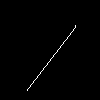

# canvas-drawer

Using Barycentric coordinates and Bresenham’s Line algorithm to implement a simple drawing api with a canvas and following functions:
- draw a line between points a and b with color interpolation between vertices
- draw a triangle given three points with color interpolation between vertices
- turn alpha blend mode on and off for figures with a given alpha
- draw a rectangle with a given center, width, and height
- draw a point
 


## How to build

*Windows*

Open git bash to the directory containing this repository.

```
canvas-drawer $ mkdir build
canvas-drawer $ cd build
canvas-drawer/build $ cmake -G "Visual Studio 16 2019" ..
canvas-drawer/build $ start Draw-2D.sln
```

Your solution file should contain two projects: `pixmap_art` and `pixmap_test`.
To run from the git bash command shell, 

```
canvas-drawer/build $ ../bin/Debug/draw_test
canvas-drawer/build $ ../bin/Debug/draw_art
```

*macOS*

Open terminal to the directory containing this repository.

```
canvas-drawer $ mkdir build
canvas-drawer $ cd build
canvas-drawer/build $ cmake ..
canvas-drawer/build $ make
```

To run each program from build, you would type

```
canvas-drawer/build $ ../bin/draw_test
canvas-drawer/build $ ../bin/draw_art
```

## Supported primitives

### Draw a line
Works by using modified versions of Bresenham’s Line algorithm




### Draw a triangle
Works by using Barycentric coordinate system for both drawing and interpolation. 


### Draw a rectangle


### Draw a point


### Add opacity to figures
Works by turning on and off the alpha blend mode while adding new figures.


## Final Result


